# Amazon Elastic File System (EFS) Lab Documentation

This documentation summarizes the completion of the guided lab on Amazon Elastic File System (Amazon EFS). The lab involved creating and configuring an EFS file system, mounting it to an EC2 instance, and examining its performance characteristics.

## Task 1: Creating a Security Group for EFS Access

In this task, a security group was created to allow inbound NFS access for the EFS mount targets.

- Navigated to the EC2 console and selected Security Groups.
- Noted the Security Group ID of the existing EFSClient security group.
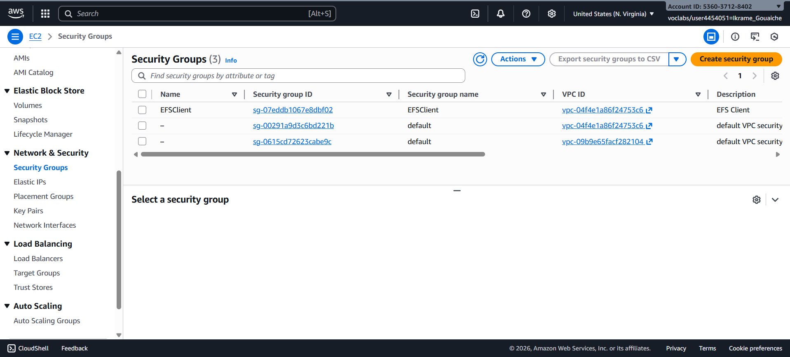
- Created a new security group named "EFS Mount Target" with inbound rules allowing NFS traffic from the EFSClient security group.

    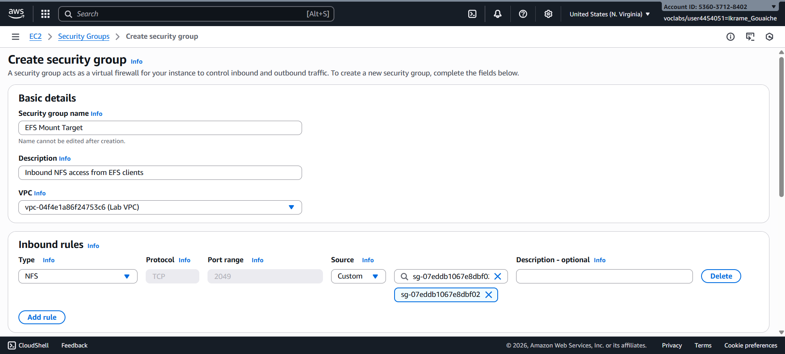

    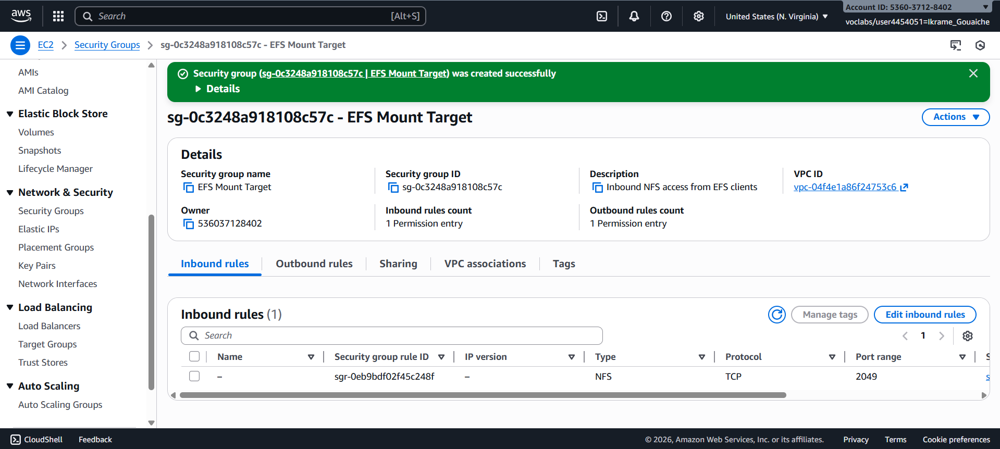

## Task 2: Creating an EFS File System

An EFS file system was created with mount targets in multiple Availability Zones.

- Accessed the EFS console and chose to create a file system with custom settings.
- Disabled automatic backups and lifecycle management.
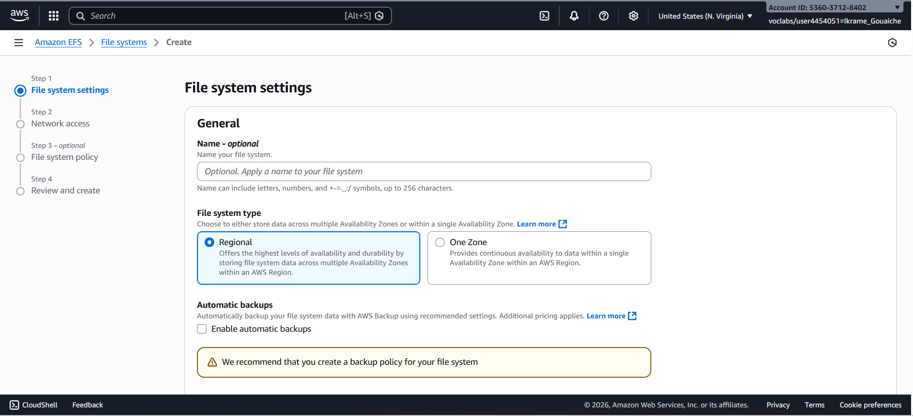

- Added a tag with Key "Name" and Value "My First EFS File System".
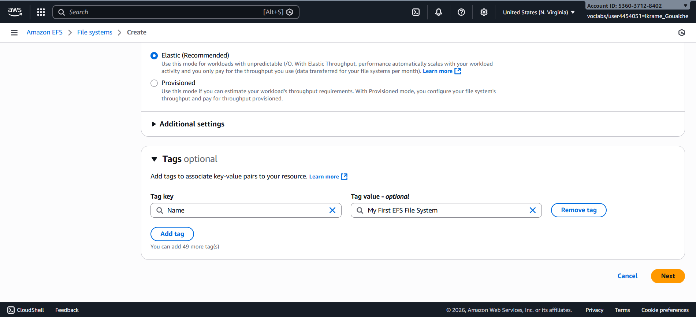

- Selected the Lab VPC and configured mount targets in each Availability Zone, attaching the "EFS Mount Target" security group.

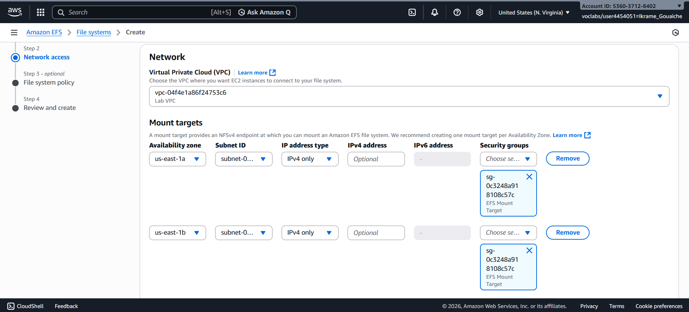

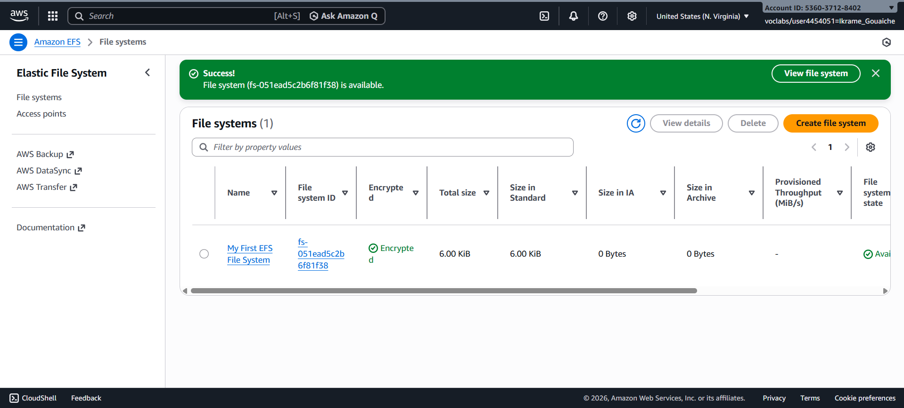

## Task 3: Connecting to the EC2 Instance

Connected to the provided EC2 instance using AWS Systems Manager Session Manager.

- Used the InstanceSessionURL from the lab details to access the EC2 instance terminal.

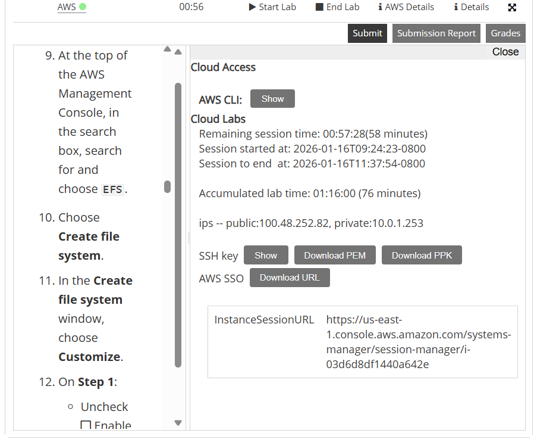

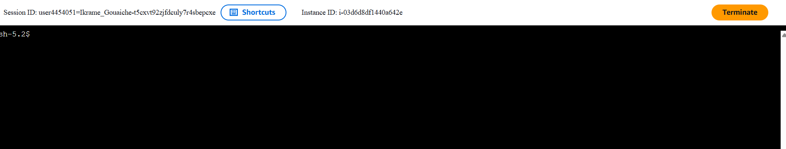

## Task 4: Creating a Directory and Mounting the EFS File System

Mounted the EFS file system to the EC2 instance.

- Installed the amazon-efs-utils package.
- Created a mount directory named "efs".
    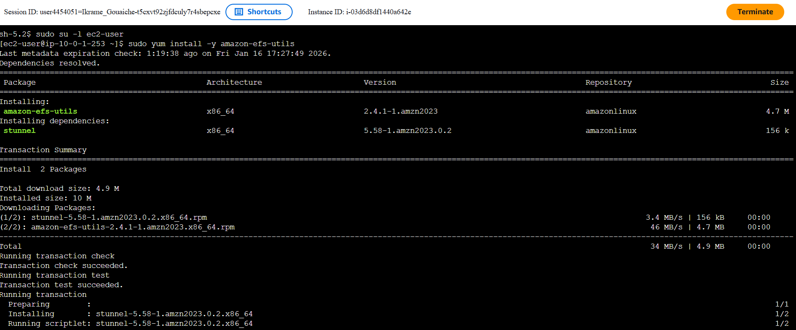
    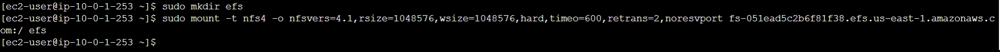
    

- Retrieved the mount command from the EFS console and executed it to mount the file system.
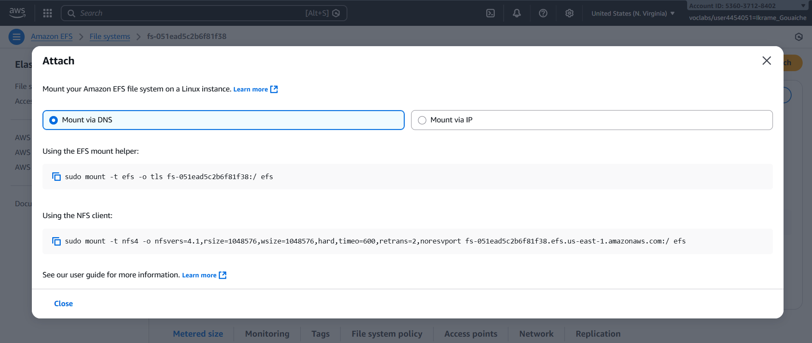

- Verified the mount using `df -hT` command, showing the EFS file system mounted with NFS.

## Task 5: Examining EFS Performance

Performed I/O benchmarking and monitored performance using CloudWatch.

- Ran the fio command to test write performance on the mounted EFS file system.
- Observed the output showing throughput metrics.

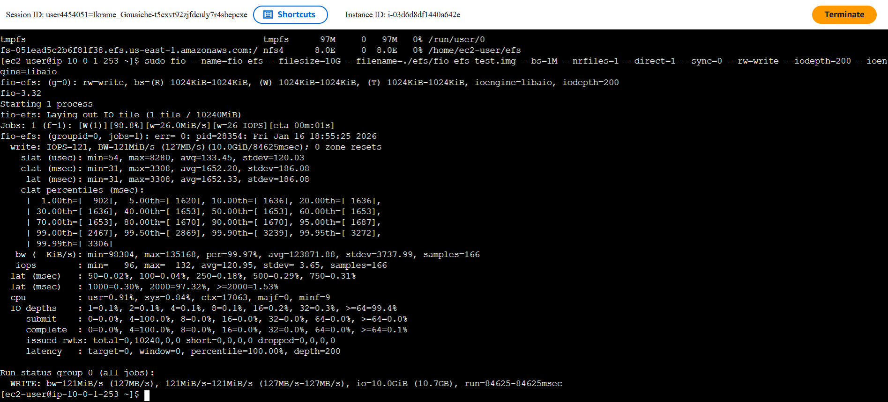

### Monitoring Performance with CloudWatch

- Accessed CloudWatch to view EFS metrics.
- Examined PermittedThroughput and DataWriteIOBytes metrics.
- Noted the peak throughput values during the test period.

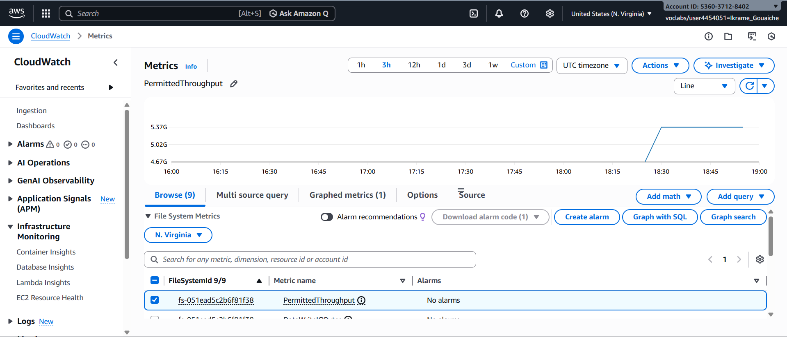

## Conclusion

The lab successfully demonstrated the creation, mounting, and performance evaluation of an Amazon EFS file system. Key achievements include:

- Secure configuration of security groups for NFS access
- Creation of a scalable EFS file system across multiple Availability Zones
- Successful mounting on an EC2 instance
- Performance benchmarking showing burst throughput capabilities
- Monitoring using CloudWatch metrics

The EFS file system provides elastic storage that scales automatically and supports high throughput for file-based workloads.
